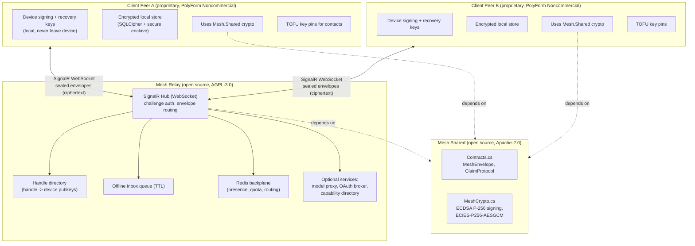
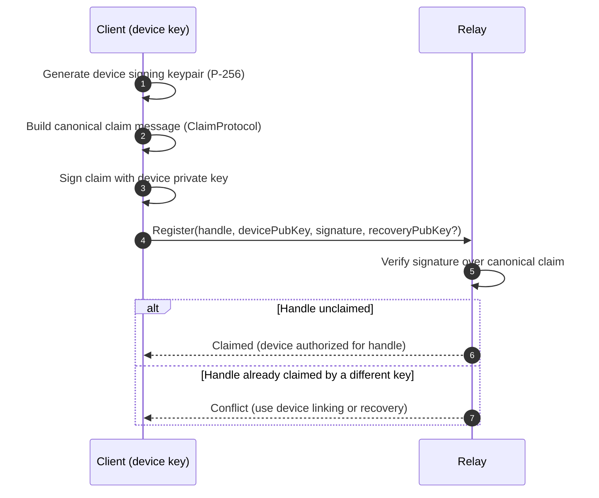
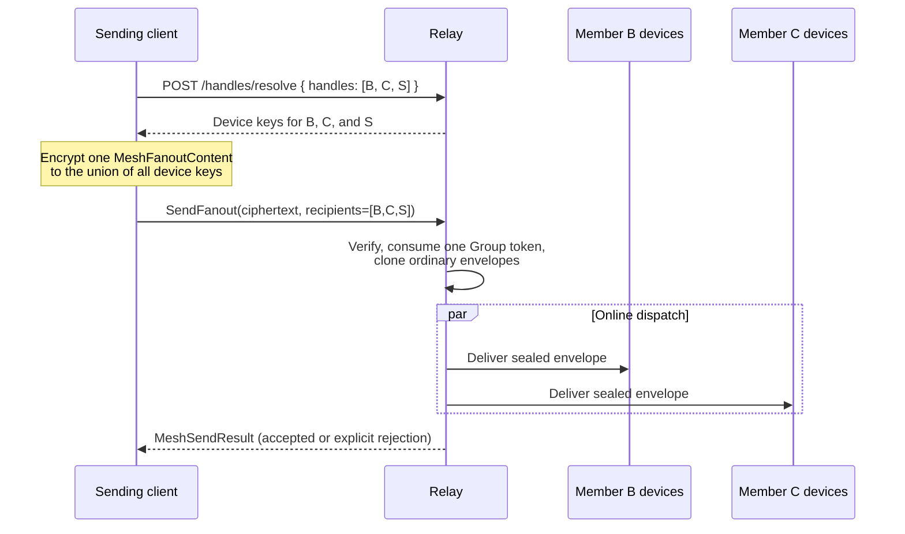
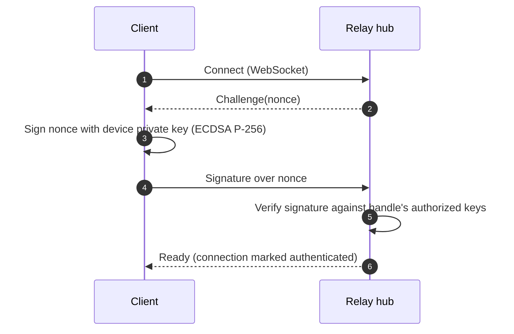
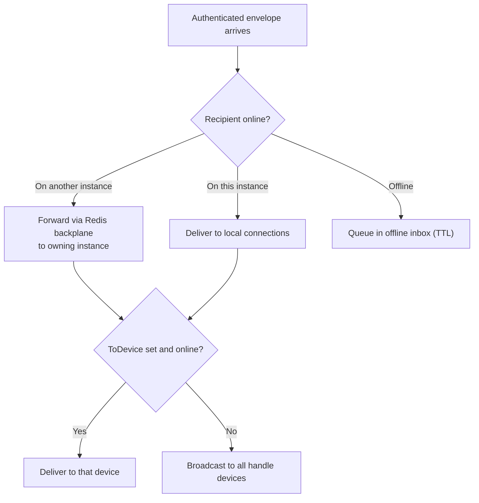
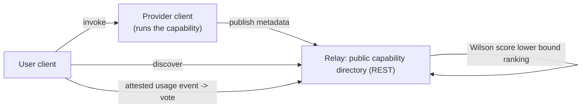

# Mesh - Architecture and Security Design

> Status: Living design document.
> Scope: This document describes the end-to-end architecture and security model of Mesh: a privacy-first, peer-to-peer messaging and capability fabric with end-to-end encryption (E2EE), key-based identity, and a self-hostable transport relay.

---

## Table of Contents

1. [Overview and Design Goals](#1-overview-and-design-goals)
2. [Component Model](#2-component-model)
3. [Identity and Key Management](#3-identity-and-key-management)
4. [End-to-End Encryption](#4-end-to-end-encryption)
5. [Transport and Relay Architecture](#5-transport-and-relay-architecture)
6. [Trust Model and TOFU Key Pinning](#6-trust-model-and-tofu-key-pinning)
7. [Optional Relay Services](#7-optional-relay-services)
8. [Data at Rest](#8-data-at-rest)
9. [Threat Model - What the Relay Can and Cannot See](#9-threat-model---what-the-relay-can-and-cannot-see)
10. [Security Assumptions, Limitations, and Non-Goals](#10-security-assumptions-limitations-and-non-goals)

---

### Licensing and Openness Legend

Mesh is a mixed open/proprietary system. The boundary matters for security reasoning, because the parts that carry your data in transit and define the wire format are fully auditable, while the client that holds your keys is proprietary but has publicly stated security properties.

| Component | Openness | License | This document describes |
| --- | --- | --- | --- |
| **Relay** (`Mesh.Relay`) | Open source | AGPL-3.0 | Full technical detail |
| **Shared library** (`Mesh.Shared`) | Open source | Apache-2.0 | Full technical detail (wire contracts + crypto) |
| **Client app** | Proprietary | PolyForm Noncommercial | Externally observable security properties and high-level responsibilities only |

Throughout this document, sections that discuss the client describe only its **externally observable security properties** (local key generation, encrypted local storage, TOFU pinning, E2EE endpoints, sandboxed public-service agent). The client's internal implementation, source layout, agent orchestration, tool-sandbox internals, and model-provider adapters are intentionally out of scope.

---

## 1. Overview and Design Goals

Mesh is built around a single organizing principle: **the network operator should never be able to read your messages, and your identity should not depend on an account they control.**

To achieve that, Mesh separates three concerns cleanly:

- **Identity and data live on the client.** Each user runs a client that generates and holds their identity keys locally, stores their data locally in encrypted form, and performs all cryptography for messages it sends and receives.
- **Transport is a dumb, sealed pipe.** A relay routes sealed (ciphertext) messages between handles over SignalR WebSockets. It authenticates senders cryptographically, but it never possesses any device private key and never sees plaintext.
- **The wire format and cryptography are open and auditable.** The shared library defines the message contracts and the encryption/signing primitives so that anyone can verify the security claims independently.

### 1.1 Design Goals

| Goal | How Mesh meets it |
| --- | --- |
| **Privacy-first** | The relay only ever handles ciphertext for message bodies. Message contents are encrypted end-to-end before they leave the client. |
| **End-to-end encryption by default** | Every message body is encrypted with a per-message content key that only the recipient devices can unwrap. |
| **Key-based identity** | There is no server-side account and no password stored on a server. Identity is a signing keypair; a handle is claimed by a signed proof of possession. |
| **Self-hostable transport** | The relay is open source (AGPL-3.0). Anyone can run their own relay and keep the associated metadata under their own control. |
| **No central account** | The relay stores a handle directory (handle to device public keys) and routing metadata, but it does not own your identity: your keys do. |
| **Multi-device** | A handle can have multiple devices; messages are multi-recipient encrypted so all of a handle's devices can read them. |
| **Auditability of the trust-critical path** | The relay and the crypto/wire library are open source; the client's security-relevant properties are publicly stated. |

### 1.2 What Mesh Is Not

- Mesh is **not** federated today. Both parties in a conversation must share a relay. Relay-to-relay federation is not implemented (see [Section 10](#10-security-assumptions-limitations-and-non-goals)).
- Mesh does **not** implement a Double Ratchet. The E2EE scheme is an ephemeral-static ECIES with a per-message content key. This provides sender-side ephemerality but not the full forward-secrecy properties of a ratcheting protocol. This is stated precisely and not overclaimed.
- The relay is **not** a trusted party for confidentiality. It is trusted only for availability and for honest routing, and even honest routing is checked client-side via TOFU key pinning.

---

## 2. Component Model

Mesh has three logical components: **client peers**, the **relay**, and the **shared library** that both sides depend on for wire contracts and cryptography.

### 2.1 Roles

| Component | Role | Trust posture |
| --- | --- | --- |
| **Client peer** | Holds identity keys, encrypts/decrypts, pins contact keys (TOFU), stores data locally encrypted. Peers are symmetric: there is no "server account." | Trusted with the user's own keys and data. Proprietary but with publicly stated security properties. |
| **Relay** | Stateless-ish transport. Authenticates connections and senders by signature, routes sealed envelopes, queues offline messages, enforces rate limits, optionally offers helper services. Never sees plaintext. | Untrusted for confidentiality; trusted for availability and honest routing (and honest routing is verified via TOFU). Open source. |
| **Shared library** | Defines `MeshEnvelope`, claim/registration contracts, and the crypto primitives (`MeshCrypto`). Used by both client and relay. | The definition of the security-critical wire format and crypto. Open source and auditable. |

### 2.2 Component Diagram



### 2.3 Deployment Shape

- Clients are **peers**. There is no privileged "host" peer.
- A relay instance can run single-node (in-memory storage) or as a horizontally scaled service (Cosmos DB for durable directory/invites/inbox, Redis for presence/quota/cross-replica routing). See [Section 5](#5-transport-and-relay-architecture).
- Both conversation parties must be registered on the **same** relay. There is no federation between relays today.

---

## 3. Identity and Key Management

Identity in Mesh is key-based. There is no server-side account, no server-stored password. A **handle** is a human-readable name that is bound to one or more device signing public keys through a signed proof of possession.

### 3.1 Key Types

| Key | Algorithm | Where generated | Where stored | Leaves device? |
| --- | --- | --- | --- | --- |
| **Device signing keypair** | ECDSA over NIST P-256 (secp256r1) | On-device | Client local encrypted store; private key never exported | Public key: yes (registered). Private key: never |
| **Recovery key** | P-256 public key captured at registration | On-device | Client local store; carried in passphrase-encrypted backups | Public key can be registered with the relay; used for the recovery path |
| **Per-message content key** | AES-256-GCM key (random 32 bytes) | On-device per message | Ephemeral in memory, zeroed after use | Never in the clear; only wrapped per recipient device |
| **Ephemeral ECDH keypair** | P-256 | On-device per message | Ephemeral; public part travels in the payload | Ephemeral public key travels with the message |

Public keys are encoded as **base64 SubjectPublicKeyInfo**. Private keys are **PKCS8** and never leave the device.

A **device identifier** is derived deterministically as the first 12 hex characters of `SHA-256(publicKeyB64)`. This deviceId is what appears in the per-recipient key map of an encrypted payload (see [Section 4](#4-end-to-end-encryption)).

### 3.2 Handle Claim and Proof of Possession

Registration binds a device public key to a handle by proving possession of the corresponding private key.

- The client constructs a **canonical claim message** (the `ClaimProtocol` canonical form) and signs it with its device signing key.
- The relay verifies the signature before accepting the registration.
- **First registration claims the handle.** The claiming device public key becomes an authorized key for that handle.
- A **different key cannot silently join a claimed handle**. If a fresh, unrelated key attempts to register an already-claimed handle, the relay returns a conflict. To add a device, the user must use **device linking** or the **recovery** path.
- A **recovery public key can be captured at registration** so that later recovery does not depend solely on an existing online device.



### 3.3 Multi-Device Linking

A handle can authorize multiple devices. Because messages are multi-recipient encrypted, every authorized device can read the handle's messages.

- An **already-authorized device** issues a **short-lived, single-use invite**. The invite has a maximum lifetime of **15 minutes** and its code is stored **hashed** by the relay (the raw code is not stored).
- A **new device redeems** the invite by presenting the code and its own device public key. On success, the new device's public key is added to the handle's authorized key set.
- Because linking requires action from an already-authorized device (or the recovery path), the relay alone cannot add a device to a handle.

```mermaid
sequenceDiagram
    autonumber
    participant D1 as Authorized device
    participant R as Relay
    participant D2 as New device

    D1->>R: CreateInvite (device-key authenticated)
    R->>R: Store hashed code, TTL <= 15 min, single-use
    R-->>D1: Invite code (shown out of band to D2)
    D2->>R: RedeemInvite(code, D2 devicePubKey)
    R->>R: Verify hashed code, not expired, not used
    R->>R: Add D2 pubkey to handle's authorized set; burn invite
    R-->>D2: Linked (device authorized)
```

### 3.4 Recovery

In addition to device linking, a **recovery path** allows a user to regain control of a handle using the recovery key that was captured at registration. Recovery is the mechanism of last resort when no already-authorized device is available to issue an invite. Backups carry the handle **recovery key** but never the **device signing keys** (see [Section 8](#8-data-at-rest)).

### 3.5 Reserved System Handles

Certain handles are **reserved** by the system (for example `meshreport`) and cannot be claimed by ordinary users. These are used for platform functions such as AI-content reporting. Reserved handles receive special treatment in the offline queue (see [Section 5.5](#55-offline-queue-and-ttl)).

---

## 4. End-to-End Encryption

Message bodies are encrypted end-to-end using a scheme labeled **`ECIES-P256-AESGCM`**. It is a **multi-recipient, ephemeral-static ECIES** built from .NET crypto primitives. Signing is separate and uses ECDSA over P-256.

> Accuracy note: this is **ephemeral-static ECIES with a per-message content key**. The ephemeral ECDH key is fresh per message (sender-side ephemerality), but recipient **device keys are long-lived**. This is **not** a Double Ratchet, and Mesh does not claim the forward-secrecy properties of a ratcheting protocol. See [Section 10](#10-security-assumptions-limitations-and-non-goals).

### 4.1 Signing

- Algorithm: **ECDSA over NIST P-256 (secp256r1)**.
- The device signing keypair is generated on-device; the private key (PKCS8) never leaves the device.
- API surface (from `MeshCrypto`): `Verify(publicKey, message, signature)` and `VerifyAny(keys, message, signature)` (verify against any of a handle's authorized keys).
- The relay verifies a signature **on registration** and **on every routed message** to assert the authenticated sender identity. The relay stamps that authenticated identity onto the envelope (see [Section 5](#5-transport-and-relay-architecture)), so a sender cannot spoof `From`.

### 4.2 The Encryption Scheme, Step by Step

For each message:

1. **Content key**: generate a random **32-byte** content key.
2. **Body encryption**: AES-256-GCM encrypt the plaintext with a random **96-bit nonce** and a **128-bit tag**.
3. **Ephemeral key**: generate a fresh **ephemeral P-256 ECDH keypair**.
4. **Per-recipient wrapping**: for **each** recipient device public key:
   - Derive a key-encryption key (KEK) via ECDH, using `DeriveKeyFromHash` with **SHA-256** over the shared secret.
   - AES-GCM-wrap the content key with that KEK (each wrap has its own iv and tag).
5. **Emit a self-describing JSON payload**:

```json
{
  "v": 1,
  "alg": "ECIES-P256-AESGCM",
  "epk": "<ephemeral public key>",
  "iv":  "<content nonce>",
  "ct":  "<ciphertext>",
  "tag": "<content GCM tag>",
  "keys": {
    "<deviceId>": { "iv": "<wrap nonce>", "wrap": "<wrapped content key>", "tag": "<wrap GCM tag>" }
  }
}
```

Key properties of the payload:

- It is **multi-recipient**: there is **one wrapped content key per recipient device**, so all of a handle's authorized devices can read the message.
- The `keys` map is keyed by **deviceId** = first 12 hex chars of `SHA-256(publicKeyB64)`.
- The payload is **self-describing** (`v`, `alg`), so decryptors can validate scheme and version.

### 4.3 Decryption

1. Look up **your deviceId** in the `keys` map.
2. Perform **ECDH** with the ephemeral public key (`epk`) to recover your KEK (same `DeriveKeyFromHash` SHA-256 derivation).
3. **Unwrap** the content key (AES-GCM) using your KEK and your `iv`/`tag` entry.
4. **Decrypt** the body (`ct`) with AES-256-GCM using `iv` and `tag`.
5. **Zero** the content key in memory after use.

### 4.4 Why the Relay Cannot Decrypt

- The relay never holds any device **private** key.
- Message bodies are ciphertext (`ct`) and the content key exists only wrapped, per recipient device, under KEKs derivable only with a recipient private key.
- The relay routes the sealed payload verbatim; it can see envelope metadata but not body plaintext.

### 4.5 Encrypt to Route to Decrypt (Sequence)

```mermaid
sequenceDiagram
    autonumber
    participant S as Sender client
    participant R as Relay (SignalR hub)
    participant Rcv as Recipient device(s)

    Note over S: Resolve recipient handle's authorized device pubkeys
    S->>S: content key = random 32 bytes
    S->>S: AES-256-GCM(plaintext, nonce 96-bit, tag 128-bit) = ct
    S->>S: Generate ephemeral P-256 ECDH keypair (epk)
    loop for each recipient device pubkey
        S->>S: KEK = ECDH + DeriveKeyFromHash(SHA-256)
        S->>S: wrap content key with AES-GCM under KEK
    end
    S->>S: Build self-describing JSON { v, alg, epk, iv, ct, tag, keys }
    S->>S: Sign envelope with device signing key (ECDSA P-256)

    S->>R: Send MeshEnvelope { To, Kind, Body = sealed payload, signature }
    R->>R: Verify sender signature; stamp authenticated From/FromDevice
    R->>R: Route (local / cross-instance via backplane / offline queue)
    R->>Rcv: Deliver sealed envelope (ciphertext only)

    Rcv->>Rcv: Look up own deviceId in keys map
    Rcv->>Rcv: ECDH with epk -> recover KEK
    Rcv->>Rcv: Unwrap content key; AES-256-GCM decrypt ct -> plaintext
    Rcv->>Rcv: Zero content key
```

### 4.6 Stateless Relay Fan-Out and Client-Side Groups

Group messaging uses a stateless relay fan-out, not a relay group resource. The relay has no group record, group API, membership table, role table, group-specific inbox, or persisted fan-out recipient list.

The client places a `GroupSnapshotPayload` (`GroupControl`) or `GroupMessagePayload` (`GroupMessage`) inside `MeshFanoutContent`, then E2E-encrypts that complete content once. Group ID, name, owner, membership, version, message type, sender, and text therefore remain inside the ciphertext. The outer `MeshFanoutRequest` is generic and carries one ciphertext plus **1 to 128** normalized recipient handles.

For each logical group operation, the client:

1. Resolves all recipient handles in one `POST /handles/resolve` request, including its own handle for linked-device sync.
2. Forms the union of all returned device public keys and fails before sending if any required handle or usable key is missing.
3. Encrypts `MeshFanoutContent` once to that union of device keys and signs the ciphertext once.
4. Invokes `SendFanout` once and checks the explicit `MeshSendResult`.

The relay authenticates the sender, verifies the signature, enforces the 128-recipient hard cap and the sender's effective policy, consumes **one Group token**, and clones ordinary envelopes with the same opaque ciphertext. It expands each handle to its registered device IDs, dispatches online devices concurrently, and creates device-specific offline inbox records only where unavoidable. An online sibling therefore cannot consume an offline device's pending group state. The transient request recipient list is not stored as a group or fan-out object.



An accepted result means the logical send was admitted for routing or queueing. Online dispatch is concurrent, and offline users receive their copies later when they reconnect. There is no atomic transaction across recipient inboxes and no guarantee of physically simultaneous delivery.

Inbound group traffic is accepted only after sender-signature verification and successful E2E decryption. A control snapshot must be well formed, contain 2 to 128 members, be sent by its declared owner, include the receiving user, and agree with any existing group ID/version state. The MVP rejects membership updates. A message must name the same sender as the authenticated envelope, target a known local group, come from a listed member, include the receiver in that group, match the local group ID and membership version, and have a message ID not already stored.

The MVP is create-only: the creator is the owner, membership cannot be edited, and there are no invite links, leave/removal protocol, history backfill, per-member read receipts, or group agents. Local clear/delete operations do not propagate. In particular, deleting local group state is not a cryptographic removal of that user from copies already held by other members.

---

## 5. Transport and Relay Architecture

The relay (`Mesh.Relay`, AGPL-3.0) is an ASP.NET Core SignalR service. It authenticates connections and senders cryptographically, routes sealed envelopes, queues messages for offline recipients, enforces rate limits, and tracks presence.

### 5.1 Connection Authentication (Challenge Handshake)

On connect, the relay issues a **challenge nonce**. The client signs the nonce with its **device signing key**; the relay verifies the signature and marks the connection **authenticated**.



After the handshake, the relay knows the authenticated handle (and device) behind the connection, and uses that to stamp outbound envelopes.

### 5.2 The Envelope

`MeshEnvelope` is the routing unit:

| Field | Purpose |
| --- | --- |
| `To` | Recipient handle |
| `From` | Sender handle - **stamped by the relay** from the authenticated connection, not trusted from the client |
| `Kind` | Message kind/type discriminator |
| `Body` | The E2E-encrypted payload (ciphertext); the relay never inspects plaintext |
| `FromDevice` (optional) | Authenticated sending device, stamped by the relay |
| `ToDevice` (optional) | Target a specific device for directed routing (for example home-device routing) |

Because `From`/`FromDevice` are relay-stamped from the authenticated connection, a sender **cannot spoof identity**. A device sending to its **own** handle is **not echoed back** to the sending connection.

`MeshFanoutRequest` is the logical fan-out unit. It carries `Id`, `Recipients` (1 to 128 transient handles), one encrypted `Body`, `Signature`, and `SentAt`. The relay converts it to ordinary per-recipient `MeshEnvelope` instances; it does not persist the request or recipient cohort. Both `SendEnvelope` and `SendFanout` return `MeshSendResult`, with `Accepted`, a machine-readable `Code` such as `accepted` or `rate_limited`, optional `RetryAfterMs`, and the accepted `RecipientCount`. A missing or rejected send is never represented as silent success.

### 5.3 Routing

The relay chooses a delivery path based on where the recipient's sockets live and whether the recipient is online:

- **Local delivery**: deliver to all of the recipient's connections on the current instance.
- **Directed cross-instance forward**: if the target socket is on another instance, forward via the **Redis backplane** to the instance holding that socket.
- **Directed device routing**: if `ToDevice` is set (for example home-device routing) and that device is online, route to it; **fall back to broadcast** to all the handle's devices if the target device is offline.
- **Offline**: if the recipient has no live connection anywhere, **queue** the message (see [Section 5.5](#55-offline-queue-and-ttl)).
- **Fan-out**: clone the generic request into device-targeted ordinary envelopes, dispatch online devices concurrently, and enqueue a device-specific inbox record for each offline device. Acceptance is logical, not an atomic or simultaneous physical-delivery guarantee.



### 5.4 Backplane and Presence

- **Redis backplane** provides: **presence** (short TTL), **per-handle quota** state, and **cross-replica directed routing** (knowing which instance holds a given socket).
- Presence entries use a short TTL so that stale connections age out.

### 5.5 Offline Queue and TTL

- Messages for an offline recipient are **queued** in a durable **Cosmos DB inbox** and **drained on connect**, ordered by **queue time**.
- Fan-out uses a device-specific inbox partition value and drains it only after that device authenticates. Legacy direct envelopes continue using the handle-wide inbox.
- Default retention is a **14-day TTL**.
- **Reserved handles** (for example `meshreport`) get **no expiry** (per-item TTL of -1), so platform-critical messages are not dropped.

### 5.6 Rate Limiting

The relay applies token buckets to **logical messages per authenticated sender handle**. Direct and Group are separate buckets, so a direct-message burst does not consume group capacity and vice versa. An ordinary send consumes one Direct token. One accepted fan-out consumes one Group token regardless of recipient count; `MaxFanoutRecipients` independently limits amplification and can never exceed the protocol hard cap of 128.

Each bucket has a steady refill rate and a burst capacity. For example, **120 messages/minute with burst 30** allows 30 immediate logical messages from a full bucket, then refills at 2 tokens per second. Rejection returns `MeshSendResult` with `Code = "rate_limited"` and `RetryAfterMs`; it is not silently dropped.

Default direct rate/burst, group rate/burst, and maximum fan-out recipients come from relay configuration. An administrative per-handle policy, when present, takes precedence as the complete effective policy. Durable deployments store policies in the Cosmos `rate-policies` container; in-memory deployments keep non-durable local overrides. Effective policies are cached per replica for `Mesh:RatePolicyCacheSeconds`; PUT and DELETE invalidate the local cache. Live token-bucket balances are shared atomically through Redis across replicas, or kept in local memory as a single-replica fallback.

### 5.7 Storage Backends

| Backend | Purpose | Notes |
| --- | --- | --- |
| **In-memory** | Default, single node | Simplest deployment; no external dependencies |
| **Cosmos DB** | Durable directory, invites, inbox, rate-policy overrides | Handle directory, device-linking invites, offline inbox, and administrative per-handle policies in `rate-policies` |
| **Redis** | Presence, live rate buckets, per-handle quota, cross-replica routing | Shared atomic bucket balances and short-TTL operational state for multi-instance deployments |

In all cases, **message bodies remain ciphertext**. Durable storage holds sealed payloads and metadata, never plaintext.

---

## 6. Trust Model and TOFU Key Pinning

### 6.1 The Threat: A Malicious or Compromised Relay

Because the relay maintains the handle directory (handle to device public keys), a malicious or compromised relay could try to **swap a contact's keys** - substituting attacker-controlled device public keys for a handle you are talking to, to attempt a man-in-the-middle.

Confidentiality does **not** rest on trusting the relay. It rests on **client-side verification** of the keys the relay serves.

### 6.2 The Mitigation: Trust On First Use (TOFU) Pinning

- Clients **pin** a contact's signing keys on **first contact**.
- If a contact's keys **later change**, inbound messages are **held** until the user **re-verifies out of band** (for example by comparing a fingerprint over a separate channel).
- Combined with client-side signature checks (`Verify` / `VerifyAny`), this ensures that a relay quietly substituting keys is detected rather than silently trusted.

```mermaid
sequenceDiagram
    autonumber
    participant U as User client
    participant R as Relay
    participant P as Contact (peer)

    U->>R: First contact with peer P
    R-->>U: P's device public keys (from directory)
    U->>U: Pin P's keys (TOFU)
    Note over U,P: Later...
    R-->>U: P's keys appear changed
    U->>U: Do NOT auto-trust; hold inbound messages
    U->>P: Re-verify fingerprint out of band
    alt Verified genuine key change (new device / recovery)
        U->>U: Update pin, release held messages
    else Cannot verify
        U->>U: Keep messages held; warn user
    end
```

### 6.3 Trust Boundaries Summary

| Party | Trusted for | Not trusted for |
| --- | --- | --- |
| **Relay operator** | Availability, honest routing, rate-limit fairness | Confidentiality of message contents; integrity of contact keys (checked via TOFU) |
| **Client (own device)** | Holding your keys, encrypting/decrypting, pinning, local storage | n/a (it is your trusted computing base) |
| **Contact's client** | Being the endpoint you pinned | Anything beyond the pinned identity until re-verified |

---

## 7. Optional Relay Services

The relay can offer optional convenience services. Each is authenticated by **device key** and has an explicit trust boundary. None of them weaken message-body confidentiality.

### 7.1 Hosted Free Model Proxy

- The relay can proxy an **OpenAI-compatible** model so that first-launch users have a working agent without configuring their own model provider.
- **Authentication**: device key.
- **Budget**: a **per-handle daily token budget**.
- **Secret handling**: the relay holds the **upstream provider key server-side**; clients **never see it**.
- **Trust boundary**: content sent to the hosted model is, by nature, visible to the model proxy path for that request. This is an explicit, optional convenience; users who do not want it can configure their own provider in the client.

### 7.2 Connector OAuth Broker

- For **confidential** connectors (those that require a client secret), the relay holds the **client secret** and performs the **OAuth token exchange** on the client's behalf.
- **Authentication**: device key.
- **Secret handling**: only **public OAuth client IDs** are ever shipped in the client. The confidential client secret stays server-side on the relay.
- **Trust boundary**: the relay is the confidential OAuth client for these connectors, so it participates in the token exchange; it does not thereby gain access to message-body plaintext.

### 7.3 Public Capability Directory and Reputation

- A **REST directory** of published services (capabilities) with **usage-gated** up/down voting.
- Ranking uses a **Wilson score lower bound** (a statistically conservative ranking that accounts for sample size, not just raw vote ratio).
- **Voting requires an attested usage event**, which resists vote stuffing by parties who never used the service.
- **What the relay stores**: only **public service metadata**. The actual capabilities **run on the provider's client at invocation**, not on the relay.



### 7.4 Optional Services - Trust Boundary Table

| Service | Relay holds | Client holds | Confidentiality impact on messages |
| --- | --- | --- | --- |
| Hosted model proxy | Upstream provider key (server-side); per-handle daily budget | Nothing secret about the upstream key | None on message bodies; model requests are a separate, opt-in path |
| OAuth connector broker | Confidential client secret; performs token exchange | Public OAuth client ID only | None on message bodies |
| Capability directory | Public service metadata; votes; rankings | Runs the actual capability at invocation | None; capability content is not stored on the relay |

---

## 8. Data at Rest

This section describes client storage as **externally observable security properties**, not implementation.

### 8.1 Client (Properties)

- **Device signing keys are generated locally and never leave the device.**
- Each identity is stored in an **encrypted SQLCipher database**. The **master key lives in the platform secure enclave**:
  - **DPAPI** on Windows,
  - **Keychain** on iOS,
  - **Keystore** on Android.
- **Backups** are **passphrase-encrypted** and carry the **handle recovery key** but **never the device signing keys**. This means a stolen backup plus its passphrase can support recovery of a handle, but does not directly yield device signing keys.
- Client-only group records persist the group ID, name, owner handle, member list, and membership version. Group chat lines also persist the actual sender handle so the UI can attribute each message.

### 8.2 Relay

- The relay stores **only ciphertext and metadata**:
  - Sealed message bodies (ciphertext) in ordinary per-recipient offline inbox records until delivered or expired.
  - The **handle directory** (handle to device public keys).
  - Device-linking invites (codes stored **hashed**).
  - Administrative per-handle overrides in the Cosmos `rate-policies` container.
  - Presence, live token buckets, quota, and routing state (Redis).
- A fan-out recipient list exists transiently while routing but is not persisted as a fan-out or group object. Offline delivery necessarily leaves separate recipient-addressed inbox records.
- The relay **never** stores plaintext message bodies and **never** holds any device private key.

### 8.3 Data-at-Rest Summary

| Location | Stored form | Keys held here? |
| --- | --- | --- |
| Client local store | SQLCipher-encrypted; master key in secure enclave | Device signing + recovery keys (private material) |
| Client backup | Passphrase-encrypted; includes recovery key, excludes device signing keys | Recovery key only |
| Relay durable store (Cosmos) | Per-recipient ciphertext inbox records, directory metadata, hashed invite codes, administrative rate policies | No private keys; only device public keys in the directory |
| Relay Redis | Presence, live rate buckets, quota, and routing state | No private keys |

---

## 9. Threat Model - What the Relay Can and Cannot See

The central privacy tradeoff of Mesh is **metadata**. The relay is designed so it can route and enforce policy without ever seeing message contents, but it does observe who talks to whom and when. Running your own relay keeps that metadata with you.

### 9.1 Visibility Table

| Item | Relay can see? | Notes |
| --- | --- | --- |
| **Handle directory** (handle to device public keys) | Yes | Needed for routing and multi-recipient encryption target resolution |
| **Presence** (who is online) | Yes | Short-TTL entries in Redis |
| **Traffic metadata** (who talks to whom, and when) | Yes | Direct envelope metadata; for fan-out, sender, transient recipient cohort, timing, and ciphertext size |
| **Inner fan-out type** | No | `GroupControl` / `GroupMessage` is inside encrypted `MeshFanoutContent`; the outer request is generic fan-out |
| **Group ID, name, membership metadata, roles, or version** | No explicit protocol field | These values exist only inside E2E-encrypted content; the relay has no group-state schema |
| **Message contents** | No | Bodies are ciphertext (`ECIES-P256-AESGCM`); relay holds no device private key |
| **Device private keys** | No | Private keys never leave the device |
| **Capability content** (what a published service actually does at invocation) | No | Capabilities run on the provider's client; relay stores only public metadata |

### 9.2 Attacker Scenarios

| Attacker | Capability | Mesh defense |
| --- | --- | --- |
| **Malicious relay operator** | Can read metadata; can attempt to swap contact keys | Cannot read message bodies (E2EE). Key swaps are detected by **TOFU pinning + client-side signature verification + out-of-band re-verify**. |
| **Sender spoofing identity** | Tries to forge `From` | Relay stamps authenticated `From`/`FromDevice` from the challenge-authenticated connection; spoofing is rejected. |
| **Unauthorized device joining a handle** | Tries to register a fresh key to a claimed handle | Rejected with conflict; joining requires device linking (short-lived, single-use, hashed invite) or recovery. |
| **Passive network observer** | Sees WebSocket traffic | Transport is over SignalR WebSockets; bodies are already E2E ciphertext independent of transport encryption. |
| **Vote manipulation on the directory** | Tries to stuff votes | Voting requires an **attested usage event**; ranking uses a **Wilson score lower bound**. |
| **Stolen client backup** | Has an encrypted backup file | Backup is **passphrase-encrypted** and excludes device signing keys; without the passphrase it is not usable. |

### 9.3 The Metadata Tradeoff (Explicit)

The relay operator can observe communication metadata. This is inherent to a routed transport that resolves handles and enforces presence, quota, and rate limits. Mesh's answer is transparency plus self-hosting: the relay is **open source (AGPL-3.0)**, and anyone can **run their own relay** so that the metadata stays under their control.

For fan-out, the relay necessarily observes the sender, transient recipient cohort, timing, and ciphertext size while routing. Repeated recipient cohorts can permit group inference or correlation even though the inner type and explicit group metadata remain encrypted. The recipient list is not persisted as a group object, but ordinary per-recipient offline inbox records may remain until delivery or expiry. Mesh does **not** claim traffic-analysis resistance or that the relay learns nothing about group activity.

---

## 10. Security Assumptions, Limitations, and Non-Goals

### 10.1 Assumptions

- The user's device and its secure enclave (DPAPI / Keychain / Keystore) are trusted. Compromise of the device compromises that identity.
- Out-of-band verification is available to the user for TOFU re-verification (a separate channel to compare fingerprints).
- The shared crypto library and relay behave as their open source defines; their auditability is part of the trust model.

### 10.2 Limitations and Non-Goals

| Topic | Statement |
| --- | --- |
| **Federation** | Relay-to-relay federation is **not implemented**. Both parties must share a relay. |
| **Forward secrecy** | The E2EE scheme is **ephemeral-static ECIES with a per-message content key**. The ephemeral ECDH key is per message (sender-side ephemerality), but **device keys are long-lived**. This is **not** a Double Ratchet; Mesh does **not** claim ratchet-grade forward secrecy. Compromise of a long-lived device private key can expose messages wrapped to that device. |
| **Metadata privacy** | Traffic metadata (who talks to whom, and when), the handle directory, and presence are **visible to the relay operator**. Self-hosting is the mitigation. |
| **Group metadata inference** | The relay stores no explicit group state and cannot read group IDs, names, membership snapshots, inner control/message type, or messages. It does see each transient recipient cohort, sender, timing, and size, so repeated cohorts may permit group inference. |
| **Group membership and history** | Groups are create-only in the MVP. There is no membership editing, invite-link, leave/removal, or history-backfill protocol. Local deletion does not revoke another member's existing history. |
| **TOFU dependence** | TOFU pinning is only as strong as the user's **out-of-band verification** when keys change. A user who blindly accepts key changes loses the protection. |
| **Hosted model proxy** | Content sent through the optional hosted model proxy is, by design, visible on that request path. It is opt-in convenience, not an E2EE channel. Users can configure their own provider in the client. |
| **Availability** | The relay is trusted for availability and honest routing. A relay can drop or delay messages (denial of service); it cannot read them. |

### 10.3 Sandboxed Public-Service Agent (Client Property)

As a stated client security property (not an implementation description): **public services run through a hard-sandboxed, service-scoped agent** that can only reach the specific public-listed capabilities attached to that service - **never** private knowledge, connectors, or local tools. **AI-content reports require explicit user consent**, and the exact shared content is shown to the user before it is sent. This bounds the blast radius of interacting with third-party published services.

---

## Appendix A: Glossary

| Term | Meaning |
| --- | --- |
| **Handle** | Human-readable identity name bound to one or more device signing public keys |
| **DeviceId** | First 12 hex chars of `SHA-256(publicKeyB64)`; used as the key in the per-recipient key map |
| **TOFU** | Trust On First Use; pin a contact's keys on first contact, hold and re-verify on change |
| **ECIES-P256-AESGCM** | Mesh's ephemeral-static ECIES: per-message AES-256-GCM content key, wrapped per recipient device via P-256 ECDH + SHA-256 KEK derivation |
| **MeshEnvelope** | Routing unit with `To`, relay-stamped `From`, `Kind`, ciphertext `Body`, optional `FromDevice`/`ToDevice` |
| **MeshFanoutRequest** | Generic logical send containing one ciphertext and 1 to 128 transient recipient handles |
| **MeshSendResult** | Explicit accepted/rejected result for a normal send or fan-out, including code and retry delay |
| **Backplane** | Redis layer providing presence, shared live rate buckets, per-handle quota, and cross-replica routing |
| **Wilson score lower bound** | Conservative ranking metric for the capability directory that accounts for sample size |

## Appendix B: Algorithm Summary

| Function | Primitive |
| --- | --- |
| Signing | ECDSA over NIST P-256 (secp256r1) |
| Public key encoding | base64 SubjectPublicKeyInfo |
| Private key encoding | PKCS8 (never leaves device) |
| Body encryption | AES-256-GCM (96-bit nonce, 128-bit tag) |
| Content key | Random 32 bytes, per message, zeroed after use |
| Key agreement | Ephemeral-static P-256 ECDH |
| KEK derivation | `DeriveKeyFromHash` with SHA-256 over the ECDH shared secret |
| Key wrapping | AES-GCM wrap of the content key, per recipient device |
| DeviceId | First 12 hex chars of `SHA-256(publicKeyB64)` |
| Client store | SQLCipher, master key in platform secure enclave (DPAPI/Keychain/Keystore) |
